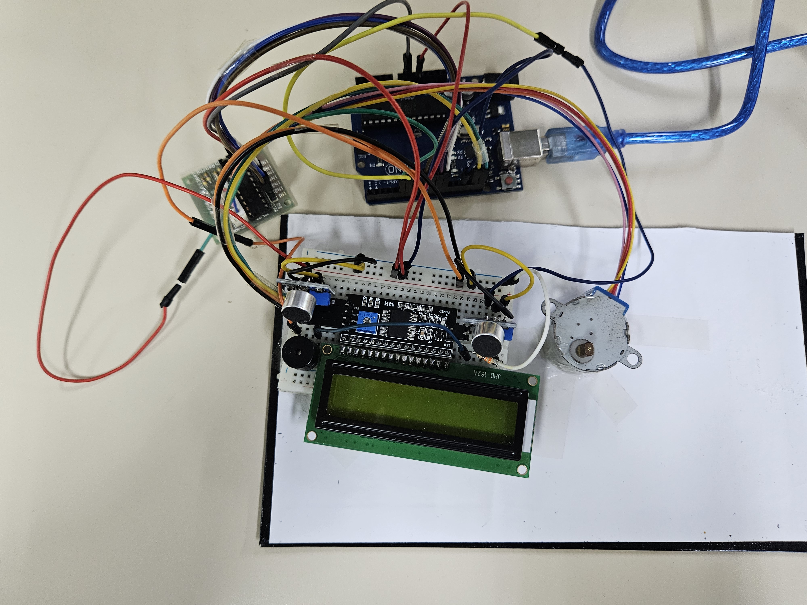
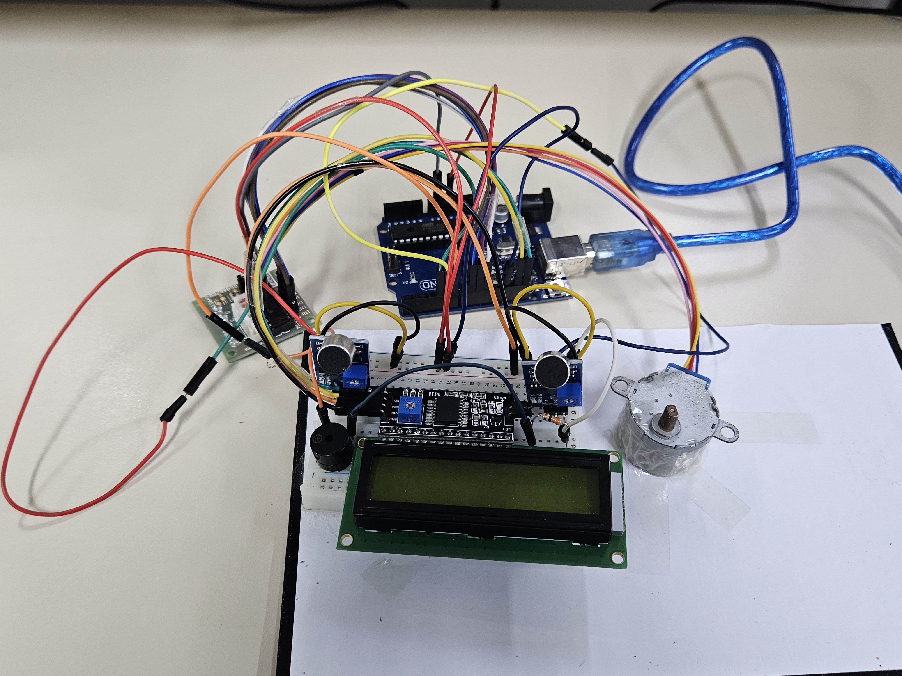
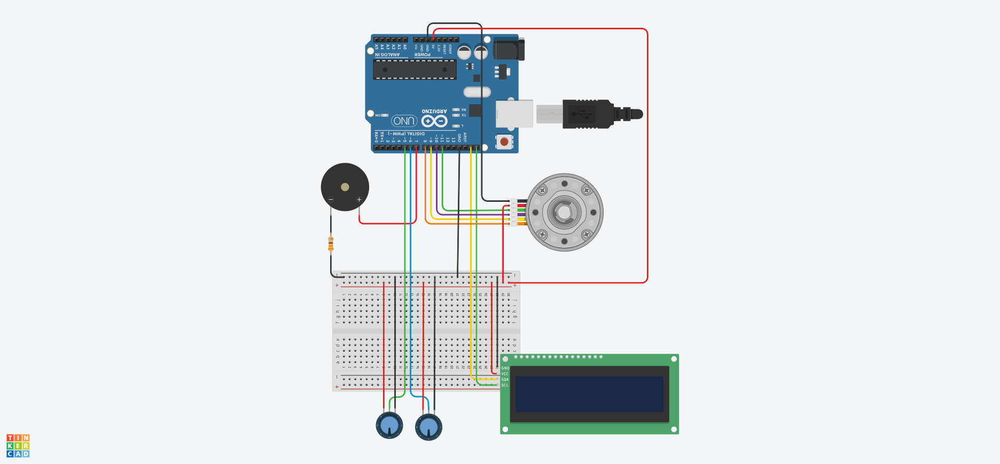

# Detector de direção do som


### Resumo

O projeto é um robô que gira para "olhar" na direção de um som emitido. Este projeto foi feito para a disciplina de Eletrônica para Computação do curso de Ciências de Computação do ICMC, da USP. 

### Componentes

| Quantidade | Componentes | Preços |
|--|--|--|
| 1 | Arduino Uno | R$ 69,21 |
| 1 | Buzzer Passivo 5V | R$ 3,14 |
| 1 | Display LCD 16x2 |R$ 9,78|
| 1 | Módulo Adaptador I2C | R$ 7,38 |
| 1 | Motor de Passo 28BYJ-48 c/Drive | R$ 16,87 |
| 2 | Sensor de Som | R$ 15,00 |
| 1 | Resistor 330 Ω | R$ 0,05 |
| **Total** |  | **R$ 121,43** |

### Funcionamento

- O projeto utiliza dois microfones, posicionados em lados opostos, para estimar a direção de um som a partir da diferença nos sinais detectados.
- Quando uma direção é estimada, um motor de passo gira todo o circuito, incluindo os microfones, na direção do som.
- Um display LCD é utilizado para simular um rosto e um buzzer para emitir sons, com o objetivo de criar um robô amigável.
- O buzzer é conectado a um resistor de 330 Ω para diminuir o volume dos sons.

## Código

```cpp

#include <Stepper.h>
#include <LiquidCrystal_I2C.h>
#include <Wire.h>

// Variáveis para ações
#define DELTA_D 23000
#define TEMPO_E 3000
#define DELTA_M 3000
#define DELTA_P 1500
#define TEMPO_M 100
#define TEMPO_P 100

LiquidCrystal_I2C lcd(0x27, 16, 2);

byte boca_centro_esq[8] = {B00000, B00000, B00000, B00000, B00000, B00001, B00010, B11100};
byte boca_centro_dir[8] = {B00000, B00000, B00000, B00000, B00000, B10000, B01000, B00111};
byte boca_dir_baixo[8] = {B00010, B00011, B00001, B00001, B00011, B00010, B00100, B11000};
byte boca_esq_baixo[8] = {B01000, B11000, B10000, B10000, B11000, B01000, B00100, B00011};
byte boca_dir_cima[8] = {B00000, B00000, B00000, B00000, B00000, B00000, B00000, B00010};
byte boca_esq_cima[8] = {B00000, B00000, B00000, B00000, B00000, B00000, B00000, B01000};

byte olho[8] = {B00000, B00000, B00000, B01110, B10011, B10001, B10001, B01110};
byte olho_piscando[8] = {B00000, B00000, B00000, B00000, B00000, B00000, B00000, B11111};

bool piscando = false, dormindo = false;
long ti_p = 0, ti_d = 0, ti_m = 0;
const int numero_passos_giro = 200, passos_por_ciclo = 4, max_pass = 50, giro_maximo = 100;
int movendo = 0;
int n_passos = 0, pos_atual = 0;

Stepper motor(numero_passos_giro, 8, 10, 9, 11);

void setup ()
{
  Serial.begin(9800);
  lcd.init();
  lcd.backlight();

  lcd.createChar(1, boca_esq_cima);
  lcd.createChar(0, boca_dir_cima);
  lcd.createChar(2, boca_esq_baixo);
  lcd.createChar(3, boca_centro_esq);
  lcd.createChar(4, boca_centro_dir);
  lcd.createChar(5, boca_dir_baixo);
  
  // Olhos
  lcd.createChar(6, olho);
  lcd.createChar(7, olho_piscando);

  lcd.setCursor(6, 0);
  lcd.write(0);
  lcd.setCursor(9, 0);
  lcd.write(1);
  lcd.setCursor(6, 1);
  lcd.write(2);
  lcd.setCursor(7, 1);
  lcd.write(3);
  lcd.setCursor(8, 1);
  lcd.write(4);
  lcd.setCursor(9, 1);
  lcd.write(5);
  lcd.setCursor(10, 0);
  lcd.write(6);
  lcd.setCursor(5, 0);
  lcd.write(6);

  pinMode(6, INPUT);
  pinMode(5, INPUT);

  pinMode(7, OUTPUT);

  randomSeed(analogRead(A2));

  motor.setSpeed(120);
}

void loop ()
{
  long t = millis();

  /* Os microfones mandam HIGH quando nenhum som é detectado
  e LOW quando, caso contrário. */
  int direita = 1 - digitalRead(6);
  int esquerda = 1 - digitalRead(5);

 if (direita == HIGH || esquerda == HIGH)
  {
    delay(100);
    ti_d = t;
    n_passos = 0;

    // Acorda o robô
    if (dormindo == true)
    {
      dormindo = false;
      lcd.backlight();
      lcd.setCursor(5, 0);
      lcd.write(6);
      lcd.setCursor(10, 0);
      lcd.write(6);
      delay(300);
      lcd.setCursor(5, 0);
      lcd.write(7);
      lcd.setCursor(10, 0);
      lcd.write(7);
      delay(100);
      lcd.setCursor(5, 0);
      lcd.write(6);
      lcd.setCursor(10, 0);
      lcd.write(6);
      delay(100);
      lcd.setCursor(5, 0);
      lcd.write(7);
      lcd.setCursor(10, 0);
      lcd.write(7);
      delay(100);
      lcd.setCursor(5, 0);
      lcd.write(6);
      lcd.setCursor(10, 0);
      lcd.write(6);
      delay(200);
      tone(7, 1500, TEMPO_M);
      delay(TEMPO_M);
      tone(7, 900, TEMPO_M);
    }
    else
    {
      if (esquerda == HIGH && direita == LOW)
      {
        movendo = 1;
      }
      else if (direita == HIGH && esquerda == LOW)
      {
        movendo = -1;
      }
      else
      {
        movendo = 0;
      }
    }
  }

  // Direita - subreai
  // Esquerda - soma

  if (abs(pos_atual) <= abs(giro_maximo))
  {
    pos_atual += movendo;
    n_passos += movendo;

    if (abs(n_passos) > abs(max_pass))
    {
      n_passos = 0;
      movendo = 0;
    }
    else
    {
      motor.step(movendo*passos_por_ciclo);
    }
  }
  else
  {
    pos_atual -= movendo;
    n_passos = 0;
    movendo = 0;
  }

  // Ações que não dependem de input
  if (t - ti_d >= DELTA_D && dormindo == false)
  {
    dormindo = true;
    ti_d = t;
    lcd.noBacklight();
    lcd.setCursor(5, 0);
    lcd.write(7);
    lcd.setCursor(10, 0);
    lcd.write(7);
  }
  if (t - ti_p >= DELTA_P && dormindo == false && piscando == false)
  {
    ti_p = t;
    piscando = true;
    lcd.setCursor(5, 0);
    lcd.write(7);
    lcd.setCursor(10, 0);
    lcd.write(7);
  }
  if (piscando == true && dormindo == false && t- ti_p >= TEMPO_P)
  {
    piscando = false;
    ti_p = t;
    lcd.setCursor(5, 0);
    lcd.write(6);
    lcd.setCursor(10, 0);
    lcd.write(6);
  }

  // Parte do código que faz o som
  if (dormindo == false && t - ti_m >= DELTA_M)
  {
    // se rand estiver entre 300 e 185, o buzzer irá fazer um som
    ti_m = t;
    long rand = random(300);
    if (rand >= 185)
    {
      tone(7, 1500, TEMPO_M);
      delay(TEMPO_M);
      tone(7, 900, TEMPO_M);
    }
  }
}

```

## Vídeo do circuito funcionando

[Vídeo no YouTube](https://www.youtube.com/watch?v=)

## Imagens do circuito





Fotos do projeto completo.



Projeto no Tinkercad.

[Link do Circuito no Tinkercad]([https://www.tinkercad.com/things/](https://www.tinkercad.com/things/8v7tix240Zq-sensor-de-direcao-do-som?sharecode=VMDjOKay2ZmGqD2se0dshB3SxqlJB_nkaiPQREiuZHg))

Obs: Os simuladores de circuito não têm microfone, então foram representados com potenciômetros.
<br>

## Membros
- Guilherme Pereira de Sá
- Lucas Rodrigues Baptista
- Nathalia Monalisa Coelho Mota
- Otávio Biagioni Melo
